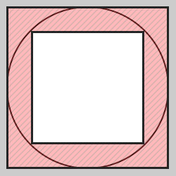

# A Circle and Two Square

`Algebra` `Math`

[View on Edabit](https://edabit.com/challenge/ApTfL3DXJtyAmiajv)

Imagine a circle and two squares: a smaller and a bigger one. For the smaller one, the circle is a circumcircle and for the bigger one, an incircle.



Create a function, that takes an integer (radius of the circle) and returns the difference of the square-areas.

### Examples

```js
squareAreasDifference(5) ➞ 50

squareAreasDifference(6) ➞ 72

squareAreasDifference(7) ➞ 98
```

### Notes

Use only positive integer parameters.
