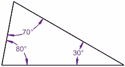

# A Possible Shape?

`Arrays` `Math` `Validation`

[View on Edabit](https://edabit.com/challenge/H2fcrbXCBPpsJ59wv)

Given the _number_ `n` and an _array of interior angles_ `angles`, return whether or not it's possible to make a polygon with `n` sides with the **angles** given. Remember that angles must be **equals or under 180°** and **over 0°**.

```js
isShapePossible(3, [80, 70, 30]) ➞ true
```



A shape with **3** sides and the angles **80°, 70° and 30°** is a possible shape.

### Examples

```js
isShapePossible(4, [90, 90, 90, 90]) ➞ true

isShapePossible(3, [20, 20, 140]) ➞ true

isShapePossible(1, [21]) ➞ false
// n must be larger than 2

isShapePossible(5, [500, 0, 20, 10, 10]) ➞ false
// you can't have an interior angle bigger than 180°
// you can't have an interior angle lower than 0° or equal to 0°
```

### Notes

- Return `false` if `n` is less than 3 (see example #3).
- There will always be an `n` number of angles given.
- The sum of interior angles is **(n - 2) x 180°**.
