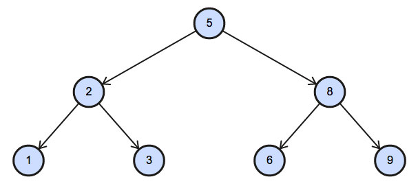

# Binary Tree Nodes

`Algorithms` `Arrays` `Conditions`

[View on Edabit](https://edabit.com/challenge/ycNLF4XMmQub5AeTt)

We have two arrays `N` and `P`, where `N` represents the value of a node in **Binary Tree**, and `P` is the parent of `N`.

| N   | P   |
| --- | --- |
| 1   | 2   |
| 3   | 2   |
| 6   | 8   |
| 9   | 8   |
| 2   | 5   |
| 8   | 5   |
| 5   | -1  |

Write a function to find the node type of Binary Tree ordered by the value of the node. Output one of the following:

- `Root`: If node is root node.
- `Leaf`: If node is leaf node.
- `Inner`: If node is neither root nor leaf node.
- `Not exist`: If node not exist.

```js
nodeType([1, 3, 6, 9, 2, 8, 5], [2, 2, 8, 8, 5, 5, -1], 5) ➞ "Root"

nodeType([1, 3, 6, 9, 2, 8, 5], [2, 2, 8, 8, 5, 5, -1], 6) ➞ "Leaf"

nodeType([1, 3, 6, 9, 2, 8, 5], [2, 2, 8, 8, 5, 5, -1], 2) ➞ "Inner"

nodeType([1, 3, 6, 9, 2, 8, 5], [2, 2, 8, 8, 5, 5, -1], 10) ➞ "Not exist"
```



### Notes

All values of `N` array are unique.
