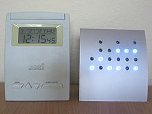
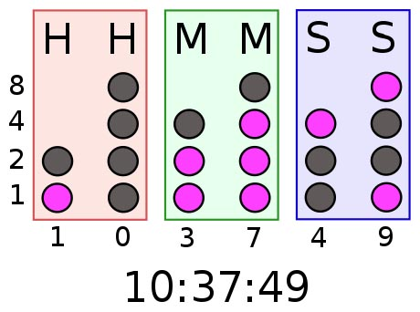

# Building A Binary Clock

`Arrays` `Strings`

[View on Edabit](https://edabit.com/challenge/3zB2qyJRpvJGCsCj4)

A binary clock displays the time of day in binary format. Modern binary clocks have six columns of lights; two for each of the hours, minutes and seconds. The photo below shows a binary clock displaying the time "12:15:45":



The binary values increase from the bottom to the top row. Lights on the bottom row have a value of 1, lights on the row above have a value of 2, then 4 on the row above that, and finally a value of 8 on the top row. Any 24-hour time can be shown by switching on a certain combination of lights. For example, to show the time "10:37:49":



You've decided to build your own binary clock, and you need to figure out how to light each row of the clock to show the correct time. Given the time as a string, return an array containing strings that shows the lights for each row of the clock (top to bottom). Use "1" for on, and "0" for off. Leave a blank space for any part of the row that doesn't require a light.

### Examples

```js
binaryClock("10:37:49") ➞ [
  " 0 0 1",
  " 00110",
  "001100",
  "101101"
]

binaryClock("18:57:31") ➞ [
  " 1 0 0",
  " 01100",
  "000110",
  "101111"
]

binaryClock("10:50:22") ➞ [
  " 0 0 0",
  " 01000",
  "000011",
  "101000"
]
```

### Notes

See the **Resources** section for more information on binary clocks.
