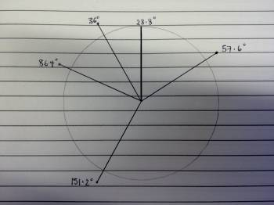

# Building a Pie Chart

`Data Structures` `Math` `Objects`

[View on Edabit](https://edabit.com/challenge/paB6XfGf6yWZ69CBs)

A pie chart is a circular graphical representation of a dataset, where each category frequency is represented by a slice (or circular sector) with an amplitude in degrees given by the single frequency percentage over the total of frequencies. You can obtain the degrees of sectors following these steps:

- Calculate frequencies total.
- Calculate percentage of every category frequency dividing it by the frequencies total.
- Transform every percentage in degrees multiplying it for 360.

You are given an object `data` with keys being the data categories (represented by letters) and values being the data frequencies. Implement a function that returns a map to design a pie chart, like to say the same object with values transformed in degrees instead of frequencies. Round final values to the nearest tenth.



_Example #1_

### Examples

```js
pieChart({ a: 1, b: 2 }) ➞ { a: 120, b: 240 }

pieChart({ a: 30, b: 15, c: 55 }) ➞ { a: 108, b: 54, c: 198 }

pieChart({ a: 8, b: 21, c: 12, d: 5, e: 4 }) ➞ { a: 57.6, b: 151.2, c: 86.4, d: 36, e: 28.8 }
```

### Notes

N/A
