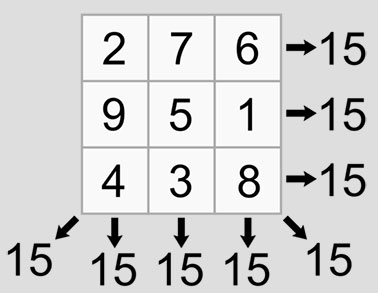

# Check Magic Square

`Algorithms` `Arrays` `Data Structures` `Loops`

[View on Edabit](https://edabit.com/challenge/iYcNv2tDvNgnSsG9S)

A "magic square" is a square divided into smaller squares each containing a number, such that the numbers in each vertical, horizontal, and diagonal row add up to the same value.



Write a function that takes a 2D array, checks if it's a magic square and returns either `true` or `false` depending on the result.

### Examples

```js
isMagicSquare([
  [8, 1, 6],
  [3, 5, 7],
  [4, 9, 2]
]) ➞ true

isMagicSquare([
  [16,  3,  2, 13],
  [ 5, 10, 11,  8],
  [ 9,  6,  7, 12],
  [ 4, 15, 14,  1]
]) ➞ true

isMagicSquare([
  [1, 2, 3],
  [4, 5, 6],
  [7, 8, 9]
]) ➞ false
```

### Notes

- Check diagonals as well.
- Test input will always be square.
- Check the **Resources** tab for additional info on magic squares.
