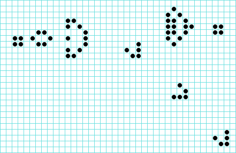

# Conway's Game of Life

`Arrays` `Conditions` `Games` `Loops`

[View on Edabit](https://edabit.com/challenge/CzfwodvnWs5QjzEgv)



The goal of this challenge is to implement the logic used in Conway's Game of Life. Wikipedia will give a better understanding of what it is and how it works (check the resources tab above).

### Rules

- **For a space that is 'populated':**
  - Each cell with 0 or 1 neighbours dies, as if by solitude.
  - Each cell with 2 or 3 neighbours survives.
  - Each cell with 4 or more neighbours dies, as if by overpopulation.
- **For a space that is 'empty' or 'unpopulated':**
  - Each cell with 3 neighbours becomes populated.

### Parameters

`board`: a 2-dimensional array of values 0 to 1.

- 0 means the cell is empty.
- 1 means the cell is populated.

### Return Value

A `string` containing the board's state after the game logic has been applied once.

```
On character: █
Off character: ░
```

The string should be divided by newlines **'\n'** to signal the end of each row.
