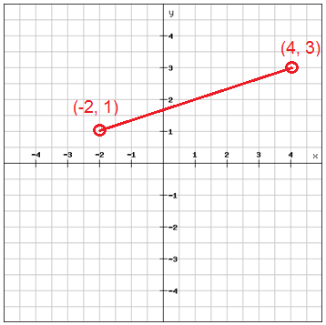

# Distance Between Two Points

`Algebra` `Language Fundamentals` `Math`

[View on Edabit](https://edabit.com/challenge/caeSeQ3K53GMQKenX)

In this challenge, you have to find the distance between two points placed on a Cartesian plane. Knowing the coordinates of both the points, you have to apply the **Pythagorean theorem** to find the distance between them.



Given two object literals `a` and `b` being the two points coordinates (**x** and **y**), implement a function that returns the distance between the points rounded to the nearest thousandth.

### Examples

```js
getDistance({x: -2, y: 1}, {x: 4, y: 3}) ➞ 6.325

getDistance({x: 0, y: 0}, {x: 1, y: 1}) ➞ 1.414

getDistance({x: 10, y: -5}, {x: 8, y: 16}) ➞ 21.095
```

### Notes

- Take a look at the **Resources** tab if you need to refresh the geometry notions related to this challenge.
