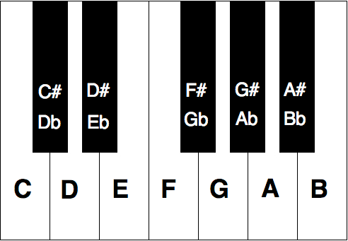

# Enharmonic Equivalents

`Formatting` `Strings`

[View on Edabit](https://edabit.com/challenge/ZMk2HeNSWX7vRewcD)

In music, notes can be written out in multiple ways (especially for notes on the black keys). Although these notes are spelled out differently, they still are the same note physically.



Given a musical note, create a function that returns its **enharmonic equivalent**. The examples below should make this clear.

### Examples

```js
getEquivalent("D#") ➞ "Eb"

getEquivalent("Gb") ➞ "F#"

getEquivalent("Bb") ➞"A#"
```

### Notes

- Note names will always be a capital letter followed by either **#** or **b**.
- Remember that the note after **G is A** and vice versa.
