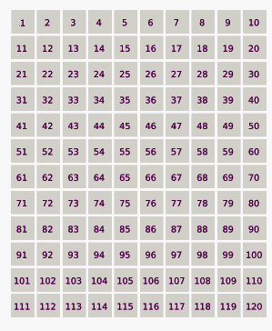

# Get the Lucky Number

`Algorithms` `Math` `Numbers`

[View on Edabit](https://edabit.com/challenge/27dNMsHnQc5LgWvQM)

A lucky number is a number of a sequence generated by a sieve algorithm: if a number in the positive integers series survives to the sieve filtering algorithm is lucky and survives, otherwise it disappears from the sequence.

- First you must obtain an arrays of numbers, from 1 to the needed size.
- First number is 1 and it survives: next to him there is number 2, that becomes the sieve's filter: every second number in the list (counting from 1) has to be filtered (as to say every even number).
- After this step, next number that survives after 1 is 3: eliminate every third number in the list (counting from 1).
- After this step, next number that survives after 3 is 7: eliminate every seventh number in the list.
- Repeat the steps incrementing the filter condition at every step (as to say, filter of actual step is equal to the number next the previous number used as filter) until there are no numbers to eliminate in list.

See the example below:

```
Step 1: Generate a list (assuming size = 25)
1, 2, 3, 4, 5, 6, 7, 8, 9, 10, 11, 12, 13, 14, 15, 16, 17, 18, 19, 20, 21, 22, 23, 24, 25

Step 2: Sieve's condition for filtering is 2: every second number from the start has to be eliminated
1, 3, 5, 7, 9, 11, 13, 15, 17, 19, 21, 23, 25

Step 3:- Sieve's condition for filtering is now 3: every third number from the start has to be eliminated
1, 3, 7, 9, 13, 15, 19, 21, 25

Step 4: Sieve's condition for filtering is now 7: every seventh number from the start has to be eliminated
1, 3, 7, 9, 13, 15, 21, 25

Step 5: Sieve's condition for filtering is now 9: every ninth number has to be eliminated, but our list now contains only 8 numbers and so the algorithm ends.
```

In the animated gif you can observe the progressive sieving process for a list of 120 numbers: purple filling is for eliminated numbers, red is for lucky ones.



Given a `size` being the dimension of starting array, write a function that returns the `nth` number of the resulting sequence after the sieving process.

### Examples

```js
getLuckyNumber(25, 5) ➞ 13
// Same set as in example in above instructions.
.
getLuckyNumber(3, 2) ➞ 3
// Original set = 1, 2, 3
// After first step = 1, 3
// No more steps possibles (filter is for every third element, length of set is 2)
// The second (nth) element is 3

getLuckyNumber(120, 13) ➞ 49
// Same set as in animated gif in above instructions.
```

### Notes

- Check **Resources** tab for more info about lucky numbers.
- Every given `size` and `nth` are valid parameters for to return a lucky number, there are no exceptions to handle.
- Despite this sieve has similarities with the "Sieve of Eratosthenes" used for retrieving prime numbers in the ancient Greece, it is more related to the ancient Rome Josephus Challenge (you can try also [this exercise](https://edabit.com/challenge/j4jFjDQZCQtJ4nDSA) or [this one](https://edabit.com/challenge/EcEN8FnruPEj6x5k4) for a similar algorithm approach).
