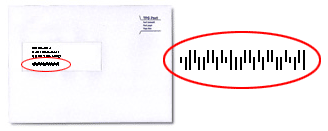

# KixCodes in the Netherlands

`Algorithms` `Formatting`

[View on Edabit](https://edabit.com/challenge/o5zmKhLucmgnqBmWy)

In The Netherlands we have PostNL, the postal company. They use KixCodes, it's a fast way to deliver letters and packages that can be scanned during the process.



The code is a combination of: `Postal code`, `House/box/call number` and `House appendage / suffix`

If there is a character between the house number and the suffix, we need to replace that with an `X`. Eventually, the code will be printed in the KixCode font.

### Examples

```js
kixCode('PostNL, Postbus 30250, 2500 GG ’s Gravenhage') ➞ '2500GG30250'

kixCode('Liesanne B Wilkens, Kogge 11-1, 1657 KA Abbekerk') ➞ '1657KA11X1'

kixCode('Dijk, Antwoordnummer 80430, 2130 VA Hoofddorp') ➞ '2130VA80430'
```

### Notes

- Your function will get an address line (string) separated by comma's.
- The input format will always be the same.
- Watch out for the different suffixes!
