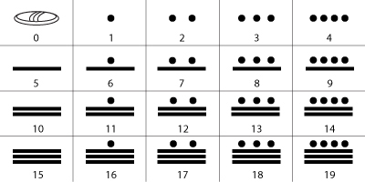

# Maya Number System

`Formatting` `Math` `Numbers`

[View on Edabit](https://edabit.com/challenge/n6ts9wQi6Dcb6bmP7)

Maya numeral system was **vigesimal** (_base 20_) and **positional**: units, tens, hundreds (and so on) were read as descendant progressive powers of 20, instead of 10 like we do with our decimal system. Some examples:

```
- 39 => (1 x 20¹) + (19 x 20º)
- 815 => (2 x 20²) + (0 x 20¹) + (15 x 20º)
- 16125 => (2 x 20³) + (0 x 20²) + (6 x 20¹) + (5 x 20º)
```

Every digit (as to say the number to be multiplied for the power of 20) was symbolized with a combination of pebbles (dots), woodsticks (lines) and shells (used for the number 0) following a _base5_ system. See the table below:



You must implement a function that given a positive integer returns an array of strings, with each string representing the symbolized single digit.

Symbols to use are "**@**" for shells, "**—**" for lines and "**o**" for dots. Dots have to be placed **before** the lines.

### Examples

```js
// Be careful, spaces between symbols are placed only for better
// readability! Don't use spaces in returned strings.

mayaNumber(39) ➞ ["o", "o o o o — — —"]

mayaNumber(815) ➞ ["o o", "@", "— — —"]

mayaNumber(16125) ➞ ["o o", "@", "o —", "—"]
```

### Notes

- You can find more information about the Maya numerals (and Maya arithmetic) in the **Resources** tab.
- All given integers are valid, no exceptions to handle.
