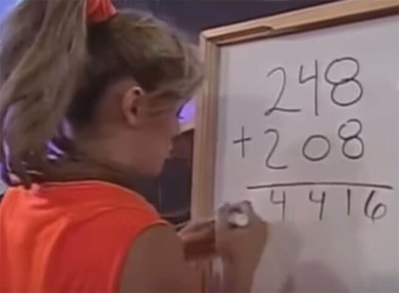

# Meme Sum :)

`Math` `Numbers`

[View on Edabit](https://edabit.com/challenge/FxFcBDTGuBCTXgZhu)

For this challenge, forget how to add two numbers together. The best explanation on what to do for this function is this meme:



### Examples

```js
memeSum(26, 39) ➞ 515
// 2+3 = 5, 6+9 = 15
// 26 + 39 = 515

memeSum(122, 81) ➞ 1103
// 1+0 = 1, 2+8 = 10, 2+1 = 3
// 122 + 81 = 1103

memeSum(1222, 30277) ➞ 31499
```

### Notes

N/A
