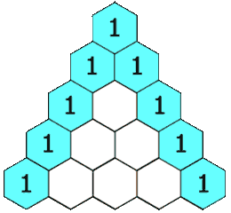

# Pascal's Triangle

`Algebra` `Algorithms` `Loops` `Math`

[View on Edabit](https://edabit.com/challenge/rDBZd8qzZzpKLxEsK)

The goal of this challenge is to return Pascal's triangle up to number 29. Pascal's triangle is the sum of the two upper corners.

```js
   1 1
  1 2 1
 1 3 3 1

// There will always be the 1 in the first
// place and the row in the second.
```



Create a function that returns a row from Pascal's triangle to find the row and column you use `n!/(k!\*(n-k)!)` where `n` is the row down and `k` is the column.

### Examples

```js
pascalsTriangle(1) ➞ "1 1"

pascalsTriangle(4) ➞ "1 4 6 4 1"

pascalsTriangle(6) ➞ "1 6 15 20 15 6 1"

pascalsTriangle(8) ➞ "1 8 28 56 70 56 28 8 1"
```

### Notes

N/A
