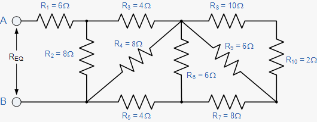

# Resistor Networks

`Algorithms` `Data Structures` `Strings`

[View on Edabit](https://edabit.com/challenge/eWXL8Jz78hP5tW644)

Resistors are electrical components that add resistance to a circuit. Resistance is measured in ohms. When resistors are connected in series, the total resistance is merely the sum of the individual resistances:

```
Rtotal = R1 + R2 + R3 + ...
```

When resistors are connected in parallel, the reciprocal of the total resistance is equal to the sum of the reciprocals of the individual resistances:

```
1/(Rtotal) = 1/R1 + 1/R2 + 1/R3 + ...
```

Let's specify that series resistors be designated by enclosing them in parentheses, and parallel resistors by enclosing them in square brackets. Now we can calculate the equivalent resistance of the network:

- `(2, 3, 6)` = 11 ohms
- `[2, 3, 6]` = 1 ohm

Nesting these structures in the same way tuples and arrays are nested allows us to model complex resistor networks.

Create a function that takes a nested network as a string and returns the equivalent resistance of the network. Round results to the nearest tenth of an ohm.

### Examples

```js
resist("(10, [20, 30])") ➞ 22.0
// 10 in series with [20, 30] in parallel.

resist("[10, (20, 30)]") ➞ 8.3
// 10 in parallel with (20, 30) in series.

resist("([10, 20], (30, 40))") ➞ 76.7
// [10, 20] in parallel in series with (30, 40) in series.

resist("(1, [12, 4, (1, [10, (2, 8)])])") ➞ 3.0

resist("(6, [8, (4, [8, (4, [6, (8, [6, (10, 2)])])])])") ➞ 10
```

### Notes

This is the schematic for the last example above:


