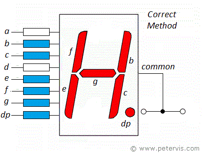

# Seven Segment Display

`Functional Programming` `Loops`

[View on Edabit](https://edabit.com/challenge/5s6d2BfJw2r8W4SqZ)

Create a function that takes a single Hexadecimal number as an argument and returns the equivalent six-digit binary number to light the display. Consider the six-digit binary number as an incoming input from a serial port. The segment display is a common cathode segment display that means you need to give a logical 1 to light up each segment.



### Examples

```js
toDisplay(0x1) ➞ 0x06
// [dp, g, f, e, d, c, b, a] = [0, 0, 0, 0, 0, 1, 1, 0]

toDisplay(0x8) ➞ 0x7F
// [dp, g, f, e, d, c, b, a] = [0, 1, 1, 1, 1, 1, 1, 1]

toDisplay(0x0) ➞ 0x3F
// [dp, g, f, e, d, c, b, a] = [0, 0, 1, 1, 1, 1, 1, 1]
```

### Notes

- Bit order is as follows MSB **[dp, g, f, e, d, c, b, a]** LSB.
- This is something that comes up in FPGA work a lot, where you have to make some kind of conversion between numerical values and bits controlling hardware. These conversions often have no simple algorithm and require hard coding.
- If you do hard code this challenge you can try to determine the correct values by yourself but in industry if you can just look up a reference, you do. In this case the code tests have all the required values.
