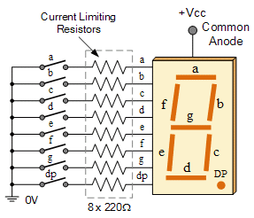

# Seven Segment Display

`Logic` `Numbers`

[View on Edabit](https://edabit.com/challenge/MDypsjjWWD7Z5R3eW)



The table below shows which of the segments `a` through `g` are illuminated on the seven segment display for the digits `0` through `9`. When the number on the display changes, some of the segments may stay on, some may stay off, and others change state (on to off, or off to on).

Create a function that accepts a string of digits, and for each transition of one digit to the next, returns an array of the segments that change state. Designate the segments that turn on as uppercase and those that turn off as lowercase. Sort the arrays in alphabetical order.

For example:

```js
sevenSegment("805") ➞ [["g"], ["b", "e", "G"]]
```

In the transition from `8` to `0`, the `g` segment turns off. Others are unchanged. In the transition from `0` to `5`, `b` and `e` turn off and `G` turns on. Others are unchanged.

| Digit | Lit Segments |
| ----- | ------------ |
| 0     | abcdef       |
| 1     | bc           |
| 2     | abdeg        |
| 3     | abcdg        |
| 4     | bcfg         |
| 5     | acdfg        |
| 6     | acdefg       |
| 7     | abc          |
| 8     | abcdefg      |
| 9     | abcfg        |

### Examples

```js
sevenSegment("02") ➞ [["c", "f", "G"]]

sevenSegment("08555") ➞ [["G"], ["b", "e"], [], []]
// Empty arrays designate no change.

sevenSegment("321") ➞ [["c", "E"], ["a", "C", "d", "e", "g"]]

sevenSegment("123") ➞ [["A", "c", "D", "E", "G"], ["C", "e"]]

sevenSegment("3") ➞ []

sevenSegment("33") ➞ [[]]
```

### Notes

N/A
