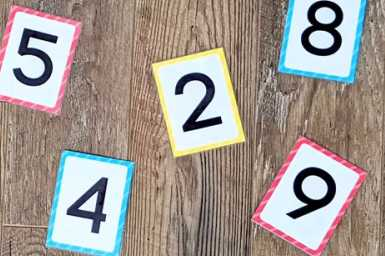

# Swapping Cards

`Algorithms` `Games` `Numbers` `Validation`

[View on Edabit](https://edabit.com/challenge/96fvErFZEjvi4yqn4)

Two players draw a pair of numbered cards so that both players can form a _2 digit number_. A winner can be decided if one player's number is larger than the other.

However, there is a rule where a player can swap any one of their cards with any one of the other player's cards in a gamble to get a higher number! Note that it is illegal to swap the order of **your own cards**. That means if you draw a `1` then a `9`, you **cannot** swap them to get `91`.



Paul's strategy is to always swap his **lowest** number with the opponent's **ten's digit**. Return whether this results in Paul winning the round.

- `n1` is Paul's number
- `n2` is his opponent's number

### Worked Example

```js
swap_cards(41, 79) ➞ true
// Paul's lowest number is 1
// The opponent's ten's digit is 7
// After the swap: 47 > 19
// Paul wins the round
```

### Examples

```js
swapCards(41, 98) ➞ true

swapCards(12, 28) ➞ true

swapCards(67, 53) ➞ false

swapCards(77, 54) ➞ false
```

### Notes

- If both of Paul's digits are the same, swap the ten's digit with the opponent's (paul likes to live riskily).
- The cards don't include the number **0**.
