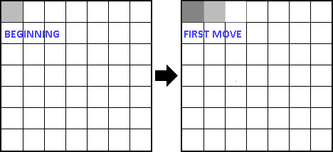

# The Snake — Area Filling

`Algorithms` `Logic` `Math`

[View on Edabit](https://edabit.com/challenge/gQuex4Ldsohmzscb3)

Assuming that you know the popular game "Snake", you have an area of x\*x, the snake length is 1 (only the head) and is positioned in the top left corner of the area at the beginning which means if your area is 7\*7 it will look something like this:



Knowing that each time the snake eats the food his length will be 2 times longer (so if the length of the snake is 4, after eating it will be 8), you have to create a function that takes a number as an argument and returns how many times the snake needs to eat to fill the entire area.

### Examples

```js
snakefill(3) ➞ 3

snakefill(6) ➞ 5

snakefill(24) ➞ 9
```

### Notes

- The argument is the length of a side of the area which mean that if the given number is 6 your area will be of 6\*6.
- The snake can exceed the borders
- The given number can't be a float.
- The given number is always positive.
